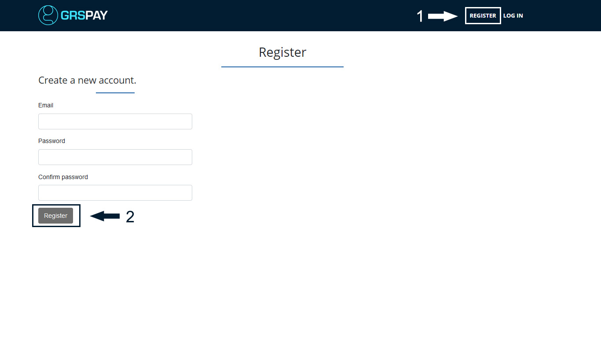
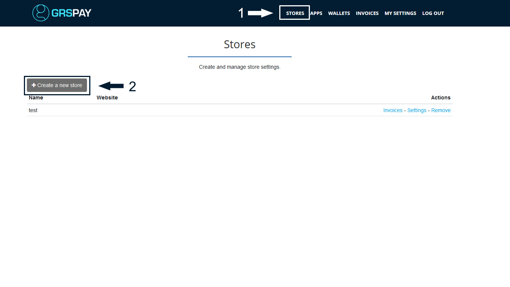

# Getting Started with GRSPay Server

After deployment, your GRSPay server needs to sync the blockchain. Depending on your machine configuration, bandwidth and the number of altcoins you added, this process usually takes between 3-4 hours.

You will see the pop-up message showing the sync progress. When your node fully syncs, the pop-up disappears.

## Account Registration

The <strong>first created account</strong> on your newly-created GRSPay server is automatically an <strong>admin</strong>. You can register your admin account even if your node is not fully synced.

To register, visit your GRSPay server URL and click on the "Register" in the upper menu. Input your password and e-mail and click "Register" button. You will automatically be logged in. If you're using a third-party host, you may be asked to verify your e-mail address.

## Creating GRSPay Store

When logged in, go to > <strong>Stores</strong> in the upper navigation menu and <strong>create a new store</strong>. You can create an unlimited number of stores on GRSPay Server.

## Customizing your GRSPay Store Settings

Store > Settings provide basis control over individual store settings. Modify the confirmations, invoice expiry and more.

### Connecting GRSPay Store to your wallet

The process of connecting a wallet and your GRSPay server is the same for both third-party or self-hosted solution. Your private keys are never uploaded nor required by the GRSPay Server. You’re only uploading the xpubkey, never private key.

There are two ways in which you can connect your GRSPay to your wallet:

1. Automatic with Ledger Nano S hardware wallet
2. Manual with any wallet supporting xpubkey (Electrum-GRS recommended)

Watch the video below or read [this article](https://bitcoinshirt.co/how-to-create-store-accept-bitcoin/8/#Connecting-BTCPay-with-your-wallet) for step by step instructions.

## Creating the Point of Sale App

GRSPay has a POS app which you can use to receive payments from your customers directly or to receive donations. To create the POS app, you need to have a store created in GRSPay.

1. Go to > Apps
2. Create a new App
3. Add a name of your app
4. Customize your PoS by adding your own items with prices, photos, and a description.
5. Click "Submit query".
6. Click "View" to preview your PoS (Your customers can access the PoS through that link).

You can change the appearance of your Point of Sale app by following [theme customization guide](Theme.md).

## Creating the Pay Button

Pay buttons are great when you have a fixed amount for a product or a donation. You can easily embed the button into HTML. When the customer or a visitor clicks on the button, GRSPay will display a checkout page and an invoice for them.

1. Go to > Store > Settings > Pay Button
2. Allow anyone to create invoices
3. Customize your button
4. Copy the generated form and embed it on your website.

## Connecting your GRSPay store to your e-commerce platform

Depending on the CMS you're using, you can easily connect GRSPay to your online store. Currently, GRSPay offers following integrations :

* [Drupal](Drupal.md)
* [WooCommerce](WooCommerce.md)
* [Magneto](https://github.com/btcpayserver/magento-plugin)
* [PrestaShop](https://github.com/btcpayserver/prestashop-plugin)
* [Custom integration](CustomIntegration.md)
